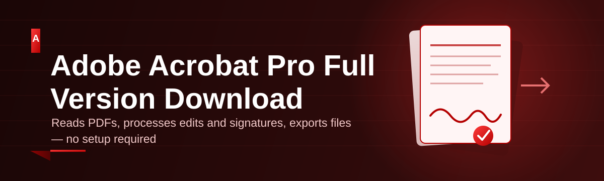
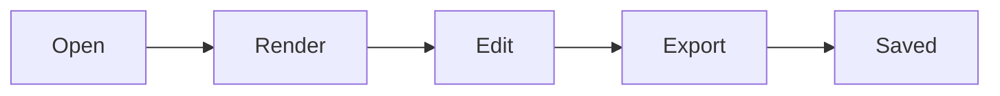

# acrobat-pro-suite 📄🚀

  

*One weekend, one dev, one PDF suite that actually opens fast — your complete Adobe Acrobat Pro full version download, streamlined for 2026.*

  

---

## 🧠 Overview

I built **acrobat-pro-suite** because I got tired of bloated PDF tools that take forty seconds to open a two-page invoice. This is a solo project — no venture capital, no bloated roadmap meetings, just a dev who wanted a clean, reliable way to package and distribute the Adobe Acrobat Pro experience without the usual friction. What started as a personal utility for wrangling contracts and scanned receipts turned into a full suite once I realized how many people were stuck fighting slow installers and confusing licensing walls just to edit a PDF.

The "Adobe Acrobat Pro Full Version Download" space is honestly kind of a mess online — mirror sites, sketchy bundlers, ten redirect pages before you even see a download button. This repo exists as a straight shot: a landing page, a build, and a suite that does what it says. Under the hood it wraps document rendering, form handling, and export pipelines into a single standalone package that behaves the same on a fresh Windows 11 install as it does on a five-year-old work laptop.

Who's this for? Freelancers signing contracts at 11pm, students annotating research PDFs, small teams merging scanned paperwork, and anyone who just wants a **Adobe Acrobat Pro download** experience that doesn't fight them at every click. If that's you, keep reading.

> [!TIP]
> Bookmark the landing page above — it always points to the current build, so you never have to go hunting for the right version again.

---

## ⚡ What It Actually Does

- **PDF editing that doesn't lag on scroll** — text, images, and page order all move in real time, even on documents pushing 300+ pages.

- **Form-field intelligence** — auto-detects fillable fields on scanned contracts and turns flat PDFs into interactive forms without manual tagging.

- **Merge & split engine** — combine a folder of scans into one clean document, or slice a massive report into digestible chapters in a couple clicks.

- **Digital signature workflow** — sign, stamp, and certify documents locally, so nothing routes through a third-party cloud service you didn't ask for.

- **Batch export pipeline** — convert dozens of PDFs to Word, Excel, or image formats in one pass instead of babysitting each file.

- **OCR for scanned junk** — turns blurry phone-camera scans into searchable, selectable text without a separate scanning app.

- **Annotation layer** — highlights, sticky notes, and markup tools that survive re-saves and don't corrupt formatting on reopen.

- **Redaction that's actually permanent** — blacked-out content is stripped from the underlying data, not just painted over.

> [!NOTE]
> Every capability above runs offline after the initial setup. Your documents stay on your machine — this suite was built for people who handle sensitive paperwork, not for feeding a cloud dashboard.

---

## 🛫 How To Get Started

1. Hit the **DOWNLOAD** button above — it routes to the official landing page, not some random mirror.

2. Grab the latest build listed there for your Windows version.

3. Run the installer and follow the on-screen prompts — no extra accounts, no hidden toolbars.

4. Launch the suite, open a PDF, and you're editing within seconds.

> [!IMPORTANT]
> Always download through the landing page linked in this repo. Anywhere else claiming to host this project is not affiliated with us and we can't vouch for what's inside.

---

## 🖥️ System Requirements

| Component | Minimum | Recommended |
|---|---|---|
| OS | Windows 10 (64-bit) | Windows 11 (64-bit) |
| RAM | 4 GB | 8 GB+ |
| Storage | 1.2 GB free | 2 GB free |
| Dependencies | None — fully standalone | None |
| Internet | Only for initial download | Not required after install |

> [!TIP]
> No .NET packs, no runtime installers, no dependency chains to chase down. Download, run, done.

---

## 🔧 How It Works

The suite is built around a simple, linear document pipeline rather than a tangle of background services:

1. **Ingest** — the app reads your PDF's structure (text layers, images, form fields) into memory.

2. **Render** — a lightweight engine paints pages on demand instead of pre-loading the entire file, which is why scroll stays smooth on huge documents.

3. **Edit** — your changes (text, signatures, redactions, merges) are tracked as discrete operations, not full re-writes.

4. **Export** — operations are flattened into a new PDF (or your chosen format) only when you hit save/export.

<strong>Why this matters for large files</strong>

Because rendering is on-demand and edits are tracked as operations rather than committed instantly, a 400-page scanned contract opens just as fast as a 4-page invoice. The heavy lifting only happens once, at export time.

---

## 🩹 Troubleshooting

**Q: The installer says "Windows protected your PC" — is that normal?**
A: Yes, this is standard SmartScreen behavior for newer, less-widely-flagged installers. Click "More info" → "Run anyway." It's a signature reputation thing, not a red flag on the file itself.

**Q: My PDF opens but form fields aren't detected.**
A: Run the OCR pass first (Tools → OCR Layer) — scanned PDFs need a text layer before form-field detection can map anything.

**Q: Export to Word looks scrambled on complex layouts.**
A: Multi-column PDFs with heavy graphics sometimes reflow awkwardly. Try "Export as Layout-Preserved" instead of "Editable Text" mode.

**Q: The app won't launch after a Windows update.**
A: Right-click the executable → Properties → Compatibility → run as Administrator once. This resets a permissions flag that sometimes gets reset by major Windows updates.

**Q: Signatures aren't showing as certified.**
A: Certification requires a saved digital ID (Edit → Digital IDs). A plain drawn signature is visual-only and won't carry certificate metadata.

**Q: Batch export is slower than single-file export.**
A: That's expected — batch mode processes sequentially to avoid memory spikes on lower-RAM machines. You can raise the thread count in Settings → Performance if you've got 8GB+.

---

## 🎨 UI / UX Details

- **Themes**: Light, Dark, and an eye-strain-friendly Sepia mode — toggle in Settings → Appearance.

- **Keyboard shortcuts**:

  | Action | Shortcut |
  |---|---|
  | Open file | `Ctrl + O` |
  | Save | `Ctrl + S` |
  | Export | `Ctrl + Shift + E` |
  | Add signature | `Ctrl + Shift + G` |
  | Merge files | `Ctrl + M` |
  | Toggle OCR pass | `Ctrl + Shift + O` |

- **Settings panel** remembers your last workspace layout, zoom level, and default export format per session.

- **Tabbed document view** — work across multiple PDFs without spawning separate windows.

> [!WARNING]
> Toggling Dark theme mid-edit on very large documents can cause a brief render flash. It's cosmetic only — nothing gets lost.

---

## 🤝 Contributing & Community

This started as a solo weekend build, but it doesn't have to stay that way. Bug reports, feature requests, and pull requests are genuinely welcome — open an issue if something's broken or clunky.

- Found a bug? Open an issue with your Windows version and a repro if possible.

- Got an idea? Discussions tab is open for feature pitches.

- Want to contribute code? Fork it, branch it, PR it — I read every one.

  

---

## 📜 License

Released under the [MIT License](LICENSE), 2026. Use it, fork it, build on it — just keep the license notice intact.

---

## ⚠️ Disclaimer

> This project is an independent, community-built suite inspired by the workflow needs behind "Adobe Acrobat Pro full version download" searches. It is not affiliated with, endorsed by, or officially connected to Adobe Inc. All trademarks belong to their respective owners. Download and use at your own discretion.

---

